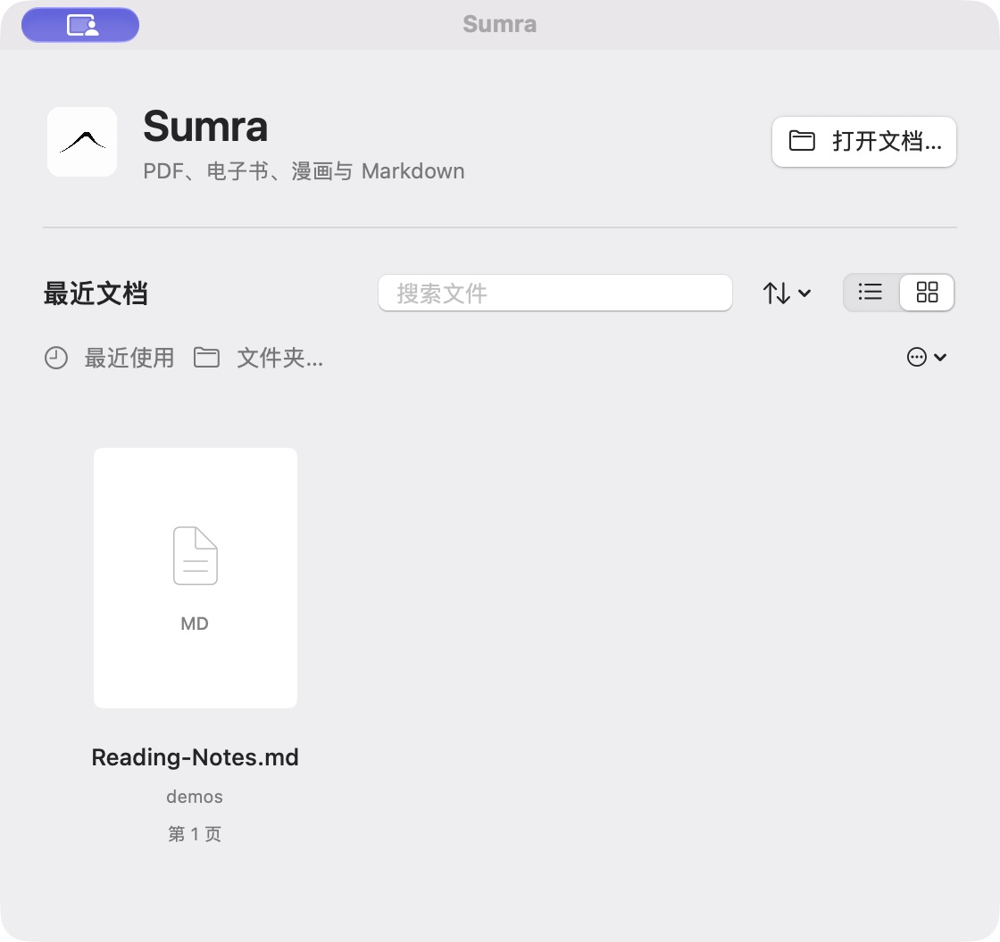
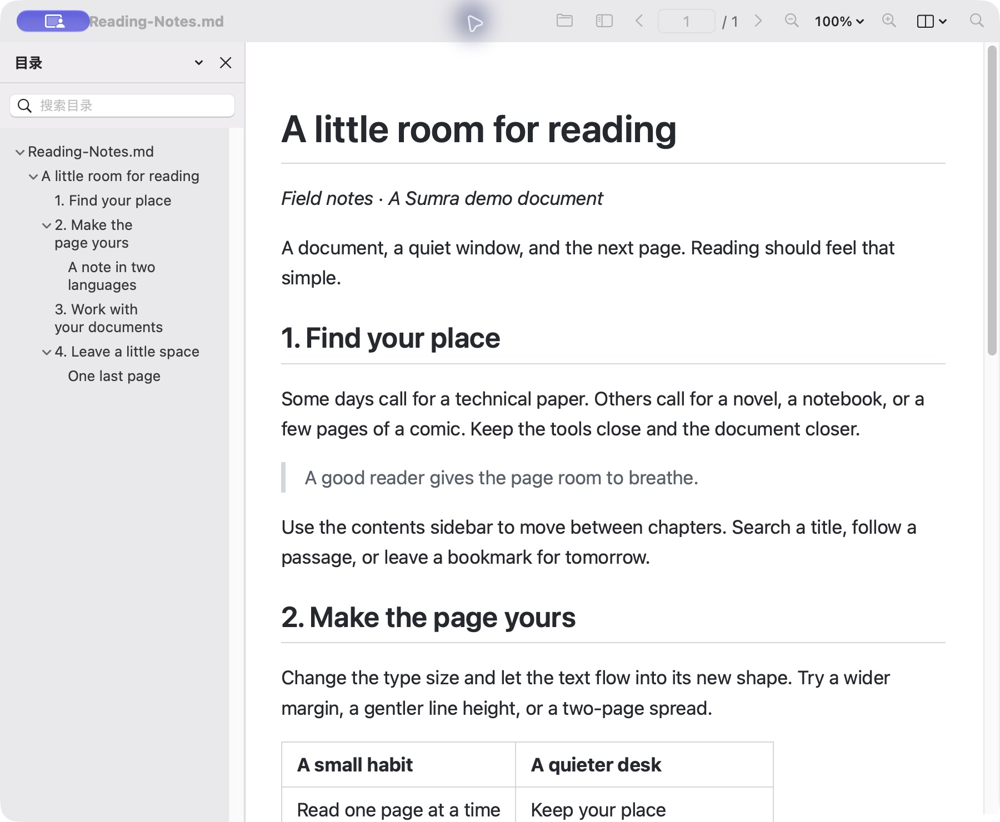
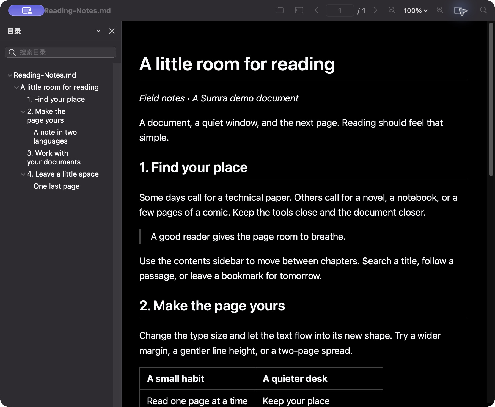

# Sumra

**A native macOS document reader that puts the page first.**

[中文](README.md) · English

Open PDFs, ebooks, comics and Markdown in one app. Built with SwiftUI and AppKit, Sumra uses macOS windows, tabs, menus and system dialogs. A compact toolbar and light and dark themes keep the document at the center of the experience.

Sumra takes inspiration from [SumatraPDF](https://www.sumatrapdfreader.org/), reuses mature document engines including MuPDF, and redesigns the interface and interaction for macOS.







Screenshots use the repository's [original demo document](docs/demos/Reading-Notes.md). They contain no private books or user data.

## Download and install

Download the app ZIP from the [latest release page](https://github.com/Ares-X/Sumra/releases/latest). The same release provides corresponding source and SHA-256 checksums.

The current distribution target is **Apple Silicon (arm64)**, with a minimum system target of **macOS 13**. The GUI has been exercised on macOS 27.0.1; compatibility on a physical Mac running macOS 13 has not yet been verified.

Installation:

1. Download and unzip the app ZIP.
2. Drag **Sumra.app** into **Applications**.
3. Open Sumra. If macOS blocks it, go to **System Settings → Privacy & Security**, choose **Open Anyway** for Sumra, and follow the confirmation prompt.

Public builds use the maintainer's personal self-signed identity, **Ares-X Code Signing**. This is not an Apple Developer ID signature, and the app is not notarized by Apple, so the first launch may require that confirmation. See [Apple's installation guidance](https://support.apple.com/en-us/102445) for details.

## Read your way

- **Open files directly**: use Finder, drag files into a window, or continue from the home screen and recent files. Multiple windows and macOS tabs are supported.
- **Navigate long documents**: contents and chapter-title search, full-text search, thumbnails, bookmarks and remembered reading positions.
- **Choose a comfortable layout**: zoom, rotate, continuous or paged layouts, two-page spreads and presentation mode. Ebooks and text offer font and typography settings.
- **Listen to the text**: use system speech to read document text or a selection aloud.
- **Work with PDFs**: fill forms, add and edit annotations, undo and redo, save or save a copy. Document tools include page extraction and merging.
- **Print and export**: use the macOS print panel or export a PDF. Available operations depend on the document's format and permissions.

PDF editing is locked by default for reading. Choose **Enable Editing** before making changes, then save or save a copy to preserve the original. Saving a copy retains editable forms and annotations; exporting a PDF produces a static reading copy.

## Supported formats

| Type | Formats |
| --- | --- |
| PDF and fixed-page documents | PDF, XPS / OXPS, SVG, DjVu |
| Ebooks | EPUB, MOBI, AZW, PRC, FB2 / compressed FB2 |
| Comics and images | CBZ, CBR, CB7, CBT, image folders; common image formats including GIF, TIFF and JPEG XL |
| Text and web documents | Markdown, HTML / XHTML, CHM, TXT and related plain text, TCR |
| Other compatible formats | PDF-compatible AI, P7M envelopes, LIT |
| Requires additional software | PostScript / EPS: install Ghostscript separately |

Large Markdown documents use MuPDF for paged reading, with a selectable WebKit compatibility mode. HTML and CHM use WebKit for reading. Printing and PDF export for HTML, CHM and Markdown compatibility mode use MuPDF layout, so the output may differ from the reading view.

Format support does not cover every file variant. Sumra does not provide OCR or DRM removal; searching scanned pages requires an existing text layer. See the [format and engine notes](docs/SUMATRA_ENGINE_PARITY.md) for detailed coverage.

## Get started

1. Press **⌘O** to open a file, or drag it into Sumra.
2. Open the sidebar for contents, thumbnails or bookmarks. The contents search field finds chapter titles.
3. Press **⌘F** to search document text.
4. Use the **View** menu to adjust layout and theme; ebooks and text offer additional typography settings.
5. Return through the home screen or recent files to continue from your last reading position.

Find more commands under **Help → Keyboard Shortcuts**. You can customize shortcuts in Settings.

## Build from source

You need macOS, the Apple Swift toolchain and macOS SDK, and CMake. Build scripts fetch pinned native dependencies, so the first build requires internet access. Swift Package Manager fetches a pinned version of Sparkle.

```sh
git clone https://github.com/Ares-X/Sumra.git
cd Sumra
./scripts/build-app.sh
open dist/Sumra.app
```

If CMake is missing, install it with your existing package manager; with Homebrew, use `brew install cmake`. Use `./scripts/build-app.sh --release` for an optimized build, or `./scripts/run-dev.sh` to build and launch a development instance. Local builds are ad-hoc signed by default and do not publish a release.

Sumra is a graphical application: file opening, document tools and printing are operated through its interface. See [THIRD_PARTY.md](THIRD_PARTY.md) for dependency sources, versions and licenses, and the [development notes](docs/IMPLEMENTATION_STATUS.md) for implementation progress.

## License and acknowledgments

New Sumra code is licensed under **[AGPL-3.0-or-later](LICENSE)**. Upstream and translated components retain their own licenses and copyright notices; see [THIRD_PARTY.md](THIRD_PARTY.md).

Thank you to [SumatraPDF](https://github.com/sumatrapdfreader/sumatrapdf), [MuPDF](https://mupdf.com/) and the other upstream projects. Sumra is an independent macOS project, not the official macOS edition of SumatraPDF, and does not promise complete feature parity.
